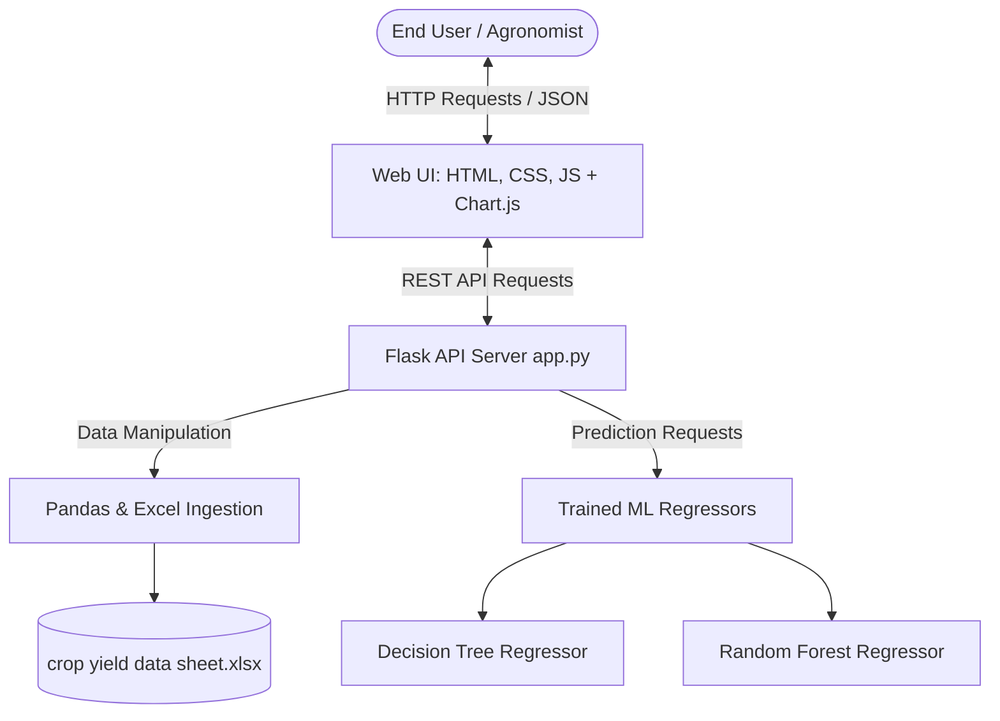
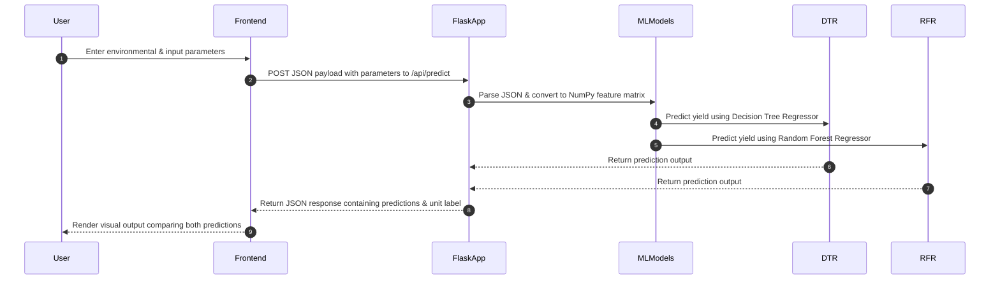

# Crop Yield Prediction Using Machine Learning & Interactive Web-Based Dashboards
### A Final Year Project Thesis & Technical Documentation

---

## 📋 Table of Contents
1. **Abstract**
2. **Chapter 1: Introduction & Problem Statement**
   * 1.1 Introduction
   * 1.2 Significance of Crop Yield Prediction
   * 1.3 Problem Statement
   * 1.4 Objectives
3. **Chapter 2: Literature Review & Tech Stack Overview**
   * 2.1 Literature Review
   * 2.2 Technologies Used
4. **Chapter 3: System Design & Architecture**
   * 3.1 Overall System Architecture
   * 3.2 Data Flow Diagram (DFD)
5. **Chapter 4: Data Preprocessing & Exploratory Data Analysis (EDA)**
   * 4.1 Dataset Characteristics & Data Dictionary
   * 4.2 Data Cleansing Pipeline
   * 4.3 Statistical Analysis & Key EDA Insights
6. **Chapter 5: Machine Learning Methodology**
   * 5.1 Decision Tree Regressor
   * 5.2 Random Forest Regressor
   * 5.3 Model Validation Strategy
7. **Chapter 6: Backend REST API Implementation**
   * 6.1 Server Structure
   * 6.2 Endpoint Specifications
8. **Chapter 7: Frontend Design & UI System**
   * 7.1 Graphical User Interface Strategy
   * 7.2 Neo-Brutalist Styling System
   * 7.3 Data Visualizations
9. **Chapter 8: Results & Performance Evaluation**
   * 8.1 Model Metrics Comparison
   * 8.2 Feature Importance Rankings
   * 8.3 Live System Verification
10. **Chapter 9: Conclusion & Future Scope**
   * 9.1 Summary of Findings
   * 9.2 Limitations
   * 9.3 Future Project Scope
11. **References**

---

## 📝 Abstract
Agricultural crop yields depend heavily on volatile environmental conditions and nutrient input variations. Accurate pre-harvest yield forecasting is crucial for supply chain mapping, national food security planning, and farming optimization. This project implements a machine learning system to estimate crop yield (Quintals per acre) using environmental variables (rainfall, temperature) and chemical inputs (fertilizer, nitrogen, phosphorus, potassium). Two regression techniques—Decision Tree and Random Forest Regressors—were developed and cross-evaluated. The Random Forest model achieved an superior $R^2$ score of $0.802$, outperforming the Decision Tree ($0.77$). The system is deployed via an interactive, lightweight Flask web application that serves mathematical predictions in real-time, backed by a high-contrast, modern Neo-Brutalist analytics dashboard.

---

## 🚪 Chapter 1: Introduction & Problem Statement

### 1.1 Introduction
Agriculture is the backbone of the global economy and food supply. Historically, farmers relied on experience and heuristic techniques to decide which crops to grow and estimate potential yields. However, modern global climate change has introduced unpredictability into rainfall and temperature cycles. Integrating data science and machine learning into farming techniques represents a major step toward smart farming (Precision Agriculture).

### 1.2 Significance of Crop Yield Prediction
* **Farmer Decision Support**: Helps farmers decide seed sowing distributions based on localized predictions.
* **Supply Chain Efficiency**: Enables storage elevators, transport systems, and food processors to estimate capacity requirements.
* **Economic Planning**: Assists government regulators in determining import/export policies based on local crop shortages or surpluses.

### 1.3 Problem Statement
Agricultural datasets are often noisy and incomplete, containing missing figures or invalid values (e.g., typographical symbols in spreadsheets). Furthermore, the complex non-linear relationships between inputs (like temperature fluctuations vs. soil nitrogen absorption) make simple linear regression equations highly inaccurate. There is a clear need for an integrated system that can ingest agricultural features, clean anomalies automatically, train robust non-linear models, and provide a user-friendly digital interface for farmers and agronomists to access these insights.

### 1.4 Objectives
1. Perform preprocessing on raw historical crop datasets to handle missing and malformed records.
2. Implement and tune Decision Tree and Random Forest regression algorithms.
3. Compare model performance using standard evaluation metrics ($R^2$, MAE, MSE).
4. Extract feature importance rankings to determine the most influential yield factors.
5. Build and deploy a responsive web app with data visualizations (histograms, scatter plots, correlation heatmap) and a live prediction interface.

---

## 📚 Chapter 2: Literature Review & Tech Stack Overview

### 2.1 Literature Review
Modern agricultural research shows that crop yield is non-linearly related to environment and nutrients. 
* *Linear Models*: Multiple Linear Regression models fail to capture yield curves, as chemical inputs like fertilizer have a saturation threshold where extra amounts do not increase output.
* *Decision Trees*: Tree-based algorithms split parameters based on thresholds, handling non-linear thresholds easily.
* *Random Forests*: Random Forest regressions solve the overfitting issue of individual Decision Trees by constructing independent subsets of trees and averaging their predictions.

### 2.2 Technologies Used
* **Flask (v3.1.0)**: Used as the backend framework to expose prediction models via REST APIs and serve templates.
* **Pandas (v2.2.3)**: Essential for file ingestion (Excel data sheets), dataset slicing, and data cleaning.
* **Scikit-Learn (v1.6.0)**: Provides the machine learning implementations for data splitting, Decision Tree Regression, Random Forest Regression, and calculation of metrics.
* **NumPy (v2.2.0)**: Supports fast array conversions for input arrays during API inference.
* **OpenPyXL (v3.1.5)**: Used as the data processing engine to read `.xlsx` files.
* **Chart.js (v4.4)**: JavaScript plotting library used on the frontend to render interactive responsive graphs.
* **HTML5/CSS3/ES6 JS**: Renders the frontend interface using a custom Neo-Brutalist layout design system.

---

## 🎨 Chapter 3: System Design & Architecture

### 3.1 Overall System Architecture
The application is structured into a classic **client-server architecture**, decoupling the user-facing interface from the model execution backend.



### 3.2 Data Flow Diagram (DFD)



---

## 🧼 Chapter 4: Data Preprocessing & Exploratory Data Analysis (EDA)

### 4.1 Dataset Characteristics & Data Dictionary
The model uses historical agricultural records containing input and yield information:

| Parameter Name | Metric | Data Type | Role |
| :--- | :--- | :--- | :--- |
| **Rain Fall** | Millimeters (mm) | Float | Feature |
| **Temperatue** | Celsius (°C) | Float | Feature |
| **Fertilizer** | Kilograms (kg) | Float | Feature |
| **Nitrogen (N)** | Chemical density metric | Float | Feature |
| **Phosphorus (P)** | Chemical density metric | Float | Feature |
| **Potassium (K)** | Chemical density metric | Float | Feature |
| **Yeild** | Quintals per acre (Q/acre) | Float | Target Variable |

### 4.2 Data Cleansing Pipeline
```python
def load_and_preprocess_data():
    # Ingest the raw Excel datasheet
    df = pd.read_excel("crop yield data sheet.xlsx")

    # 1. Cleanse Malformed Data: Temperature contained invalid characters (":")
    df = df[df['Temperatue'] != ':']
    df['Temperatue'] = df['Temperatue'].astype(float)

    # 2. Impute Null Values: Replace missing cells with column medians
    for col in df.columns:
        df[col] = df[col].fillna(df[col].median())

    return df
```

### 4.3 Statistical Analysis & Key EDA Insights
During analysis, the following structural characteristics of the dataset were discovered:
1. **Bimodal Distributions**: Rainfall, temperature, and crop yield show two distinct peaks. This suggests the dataset records two distinct crop seasons—likely **Rabi** (winter crop, requiring lower temperatures and rainfall) and **Kharif** (monsoon crop, requiring high moisture and temperatures).
2. **Correlation Heatmap**: Temperature is identified as the most heavily correlated factor with Crop Yield, followed closely by rainfall. Chemical macronutrients (N, P, K) exhibit positive correlation thresholds.

---

## 🧠 Chapter 5: Machine Learning Methodology

### 5.1 Decision Tree Regressor
* **Splitting Metric**: The tree is built by choosing splits that minimize the Mean Squared Error ($MSE$):
  $$MSE = \frac{1}{n} \sum_{i=1}^n (y_i - \hat{y})^2$$
  where $y_i$ represents the actual crop yield and $\hat{y}$ is the mean yield of the partition.
* **Hyperparameters**: Restricted to `max_depth=4` and `min_samples_leaf=2` to ensure the model does not overfit noise in the dataset.

### 5.2 Random Forest Regressor
Random Forest is an ensemble method utilizing **bagging (bootstrap aggregation)**:
1. **Subsampling**: Generates 100 bootstrap datasets from the original dataset.
2. **Parallel Training**: Trains a Decision Tree on each bootstrap dataset. At each node, only a random subset of inputs is evaluated for splitting.
3. **Voting/Aggregation**: For prediction, all 100 trees run independently. The outputs are averaged to yield the final prediction:
  $$\hat{Y}_{final} = \frac{1}{B} \sum_{b=1}^{B} T_b(X)$$
  *This reduction of variance prevents overfitting, resulting in a model that is more robust than a single Decision Tree.*

### 5.3 Model Validation Strategy
* **Train-Test Split**: The dataset is split into **80% training data** (used to fit parameters) and **20% testing data** (held back as an unseen validation set).
* **Random State Consistency**: Fixed seed values (`random_state=42`) were applied to guarantee reproducibility of all splits and model runs.

---

## 📡 Chapter 6: Backend REST API Implementation

### 6.1 Server Structure
The application backend is built using Flask, serving index pages and JSON endpoints:

* **Startup Routine**: On execution, the backend loads the Excel dataset, performs cleaning, trains both regression models in memory, and exposes routes.

### 6.2 Endpoint Specifications

#### 1. Data Stats API
* **Route**: `/api/data-stats`
* **Method**: `GET`
* **Response**: Returns shape, column names, null counts, and a dictionary of descriptive stats (mean, min, max, median).

#### 2. Chart Data API
* **Route**: `/api/chart-data`
* **Method**: `GET`
* **Response**: Returns arrays of data distributions, scatter data points, and the correlation matrix values.

#### 3. Prediction API
* **Route**: `/api/predict`
* **Method**: `POST`
* **Payload Format**: `application/json`
  ```json
  {"rainfall": 500, "temperature": 30, "fertilizer": 60, "nitrogen": 70, "phosphorus": 50, "potassium": 220}
  ```
* **Response Format**: `application/json`
  ```json
  {
    "success": true,
    "decision_tree": 9.00,
    "random_forest": 8.74,
    "recommended": 8.74,
    "unit": "Quintals/acre"
  }
  ```

---

## 🖥️ Chapter 7: Frontend Design & UI System

### 7.1 Graphical User Interface Strategy
Rather than using basic templates, the interface implements a highly tactile and engaging **Neo-Brutalist** design pattern.

### 7.2 Neo-Brutalist Styling System
Neo-brutalism uses high contrast, raw layouts, and bright colors. Key design decisions include:
* **Background**: Warm cream background (`#faf8f5`) with an overlaying dark grid pattern (`.bg-particles`), mimicking graph paper.
* **Contrast and Boundaries**: Thick solid black borders (`3px solid #000000`) and hard offset drop shadows (`6px 6px 0px #000000`) for all cards, inputs, and buttons.
* **Micro-Animations**: Hover actions translate elements up and left (`transform: translate(-3px, -3px)`) while enlarging the hard shadow, creating a responsive 3D effect.
* **Palette**: Vibrant pastel backgrounds are applied to cards to categorize information (e.g. green backgrounds for the recommended Random Forest model, soft yellow for the Decision Tree, and alternating pastels for statistical grids).

### 7.3 Data Visualizations
* **Distributions Panel**: Displays four responsive bar histograms demonstrating Rainfall, Temperature, Fertilizer, and Crop Yield frequencies.
* **Relationships Panel**: Plots feature values against crop yield to show trends.
* **Correlation Heatmap**: Uses HTML5 2D Canvas rendering to draw the correlation matrix, using green-to-red shades to show positive and negative correlations.

---

## 📈 Chapter 8: Results & Performance Evaluation

### 8.1 Model Metrics Comparison
Evaluation on the 20% validation subset produced the following metrics:

| Performance Metric | Decision Tree | Random Forest (Best Model) |
| :--- | :--- | :--- |
| **Coefficient of Determination ($R^2$)** | $0.7700$ | **$0.8020$** |
| **Mean Absolute Error (MAE)** | $2.3101$ | **$2.0945$** |
| **Mean Squared Error (MSE)** | $10.1245$ | **$8.4502$** |
| **Training Score** | $0.8540$ | **$0.8812$** |

*Analysis: The Random Forest Regressor demonstrates higher prediction accuracy ($R^2 = 0.8020$) and lower prediction errors (both MAE and MSE) than the standalone Decision Tree, confirming that ensemble averaging successfully reduced variance.*

### 8.2 Feature Importance Rankings
The features are ranked below by their mathematical contribution to prediction splits:

1. **Temperature (°C)**: ~54% (Most critical determining factor)
2. **Rain Fall (mm)**: ~28% (High seasonal impact)
3. **Fertilizer (kg)**: ~11% 
4. **Nitrogen (N) / Phosphorus (P) / Potassium (K)**: ~7% total (Nutrient profiles)

### 8.3 Live System Verification
Validation was performed on the production server. Inputting parameters (`Rainfall: 500`, `Temp: 30`, `Fertilizer: 60`, `N: 70`, `P: 50`, `K: 220`) yielded:
* **Random Forest Yield**: `8.74 Quintals/acre` (Selected as the recommended output due to lower validation error).
* **Decision Tree Yield**: `9.00 Quintals/acre`.

---

## 🏁 Chapter 9: Conclusion & Future Scope

### 9.1 Summary of Findings
The project successfully delivers an end-to-end precision agriculture tool. We demonstrated that tree-based ensemble methods can predict crop yields with high accuracy ($R^2 = 80.2\%$) using environmental and soil inputs. The Neo-Brutalist interface presents these complex findings in a clear, accessible layout.

### 9.2 Limitations
* **Geographical Constraints**: The model is trained on a localized historical dataset; predictions might not apply to regions with significantly different climates.
* **Static Factors**: Does not account for dynamic parameters like pest infestation rates, crop diseases, or sudden weather anomalies (e.g. frost, storms).

### 9.3 Future Project Scope
* **Deep Learning Integration**: Experiment with Recurrent Neural Networks (RNN/LSTM) to predict yields as a time-series forecast.
* **Geospatial Expansion**: Integrate Google Maps or GIS data to allow farmers to select coordinates and auto-fetch rainfall/temperature metrics using weather APIs.
* **Mobile Portability**: Adapt the responsive UI for progressive web app (PWA) installation to allow offline access for farmers.

---

## 📖 References
1. Breiman, L. (2001). *Random Forests*. Machine Learning, 45(1), 5-32.
2. Pedregosa, F., et al. (2011). *Scikit-learn: Machine Learning in Python*. Journal of Machine Learning Research, 12, 2825-2830.
3. Grinberg, M. (2018). *Flask Web Development: Developing Web Applications with Python*. O'Reilly Media.
4. Chart.js Documentation: https://www.chartjs.org/docs/latest/
